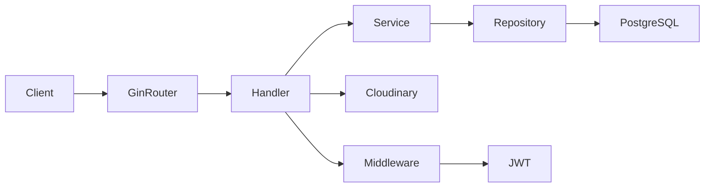

# DRAV E-Commerce Platform — Backend
> Secure commerce APIs for authentication, catalog, and transactional checkout

## Overview
DRAV Backend is a Go-based REST API for a marketplace workflow connecting buyers and sellers. It handles Google-based authentication, seller onboarding, product management, cart management, and checkout with transactional stock updates in PostgreSQL. The project is structured with a layered architecture (handler/service/repository) and includes Swagger docs for API exploration.

This repository is in active development. The current API already runs core commerce flows, while the base schema in `db/migration/000001_init_schema.up.sql` indicates the intended full platform scope (payments, reviews, and behavioral data for personalization).

## Features
- Google Sign-In endpoint with Google ID token validation and JWT issuance (`POST /api/auth/google`)
- JWT-protected route group using bearer token middleware (`/api` protected routes)
- Product catalog API with pagination and filtering (`page`, `limit`, `search`, `min_price`, `max_price`)
- Product detail retrieval by ID and protected product creation
- Product image upload to Cloudinary with mime-type and size validation (JPEG/PNG/WebP, max 5 MB)
- Seller registration flow with conflict handling (one seller profile per user)
- Cart operations with upsert logic and stock validation before quantity updates
- Checkout flow with DB transaction, order + order item creation, stock deduction, and cart clearing
- CORS allowlist middleware and IP-based rate limiting (used on auth endpoint)
- Swagger/OpenAPI docs exposed at `/swagger/*any`

### Planned System Flow (Schema-Driven, WIP)
Based on `db/migration/000001_init_schema.up.sql`, the target system behavior is:
- Buyer activity tracking via `user_behavior` table (product interactions per user)
- Product review lifecycle via `reviews` table, including seller rating aggregation logic
- Payment lifecycle via `payments` table (`payment_method`, `status`, `paid_at`) connected to orders
- Full marketplace loop: discovery -> cart -> checkout -> payment -> post-purchase review -> personalization

These tables are already defined in schema, but related service/handler implementations are still being completed.

## Tech Stack
- Go `1.25.5`
- Gin `v1.12.0`
- PostgreSQL (not version-pinned in repository)
- pgx driver `github.com/jackc/pgx/v5 v5.9.2`
- JWT `github.com/golang-jwt/jwt/v5 v5.3.1`
- Google ID token validation `cloud.google.com/go/auth v0.20.0`
- Cloudinary SDK `github.com/cloudinary/cloudinary-go/v2 v2.15.0` (indirect dependency used by handlers)
- Swagger tooling `swaggo/swag v1.16.6`, `gin-swagger v1.6.1`, `swaggo/files v1.0.1`
- Dotenv loader `github.com/joho/godotenv v1.5.1`
- Rate limiting `golang.org/x/time v0.15.0`

## Architecture
The backend uses a layered architecture similar to Clean Architecture boundaries:
- `handler`: HTTP transport, request parsing, response mapping
- `service`: business rules and validation
- `repository`: SQL/data access
- `model`: domain and request/response structures
- `middleware` and `pkg`: cross-cutting concerns (auth, CORS, rate limit, DB, JWT)



## Getting Started
### Prerequisites
- Go `1.25.5`
- PostgreSQL running locally
- `migrate` CLI (used by `Makefile` targets)

### Installation
```bash
git clone <your-backend-repo-url>
cd drav-backend

cp .env .env.local  # optional backup; .env is already used by app
go mod download

# Run migrations
make migrateup

# Start API server
go run ./api
```

Swagger UI will be available at `http://localhost:8080/swagger/index.html`.

### Environment Variables
Note: the repository currently contains `.env` and does not provide `.env.example` yet.

- `DB_USER`: PostgreSQL username
- `DB_PASSWORD`: PostgreSQL password
- `DB_HOST`: PostgreSQL host
- `DB_PORT`: PostgreSQL port
- `DB_NAME`: PostgreSQL database name
- `PORT`: API server port
- `GOOGLE_CLIENT_ID`: Google OAuth client ID used to validate Google ID tokens
- `GOOGLE_CLIENT_SECRET`: Google OAuth client secret (currently not used directly in runtime code)
- `JWT_SECRET`: HMAC secret for signing/verifying JWT
- `CORS_ALLOWED_ORIGINS`: comma-separated allowed CORS origins
- `CLOUDINARY_URL`: Cloudinary connection URL for product image uploads

## Project Structure
```text
drav-backend/
├── api/                    # application entrypoint (Gin bootstrap + route wiring)
├── db/
│   └── migration/          # SQL schema and migration files
├── docs/                   # generated Swagger/OpenAPI docs
├── internal/
│   ├── handler/            # HTTP handlers per feature
│   ├── middleware/         # auth, CORS, and rate-limit middleware
│   ├── model/              # domain and request models
│   ├── repository/         # PostgreSQL data access layer
│   └── service/            # business logic/use cases
├── pkg/
│   ├── apperror/           # shared app-level errors
│   ├── database/           # DB connection bootstrap
│   └── utils/              # JWT helper utilities
├── Makefile                # migration commands
├── go.mod                  # Go module and dependency versions
└── go.sum                  # dependency checksums
```

## AI Integration
Current state in this backend is authentication-focused rather than recommendation-focused:
- Implemented: Google ID token verification (`cloud.google.com/go/auth/credentials/idtoken`) and JWT generation.
- Schema foundation is ready for recommendation inputs (`user_behavior`) and trust signals (`reviews`, seller rating).
- Planned/WIP: recommendation engine and review business rules are not yet implemented in runtime service/handler code.
- No LLM/embedding/vector-store integration is currently present in runtime backend code.

## Deployment
No Dockerfile or `docker-compose.yml` is currently included in this repository (WIP).

For manual deployment:
```bash
go mod download
make migrateup
go run ./api
```

## Contributing
1. Fork the repository and create a feature branch.
2. Keep changes scoped and include/update tests for handlers/services when applicable.
3. Run `go test ./...` before opening a pull request.
4. Open a PR with clear summary, motivation, and test notes.
